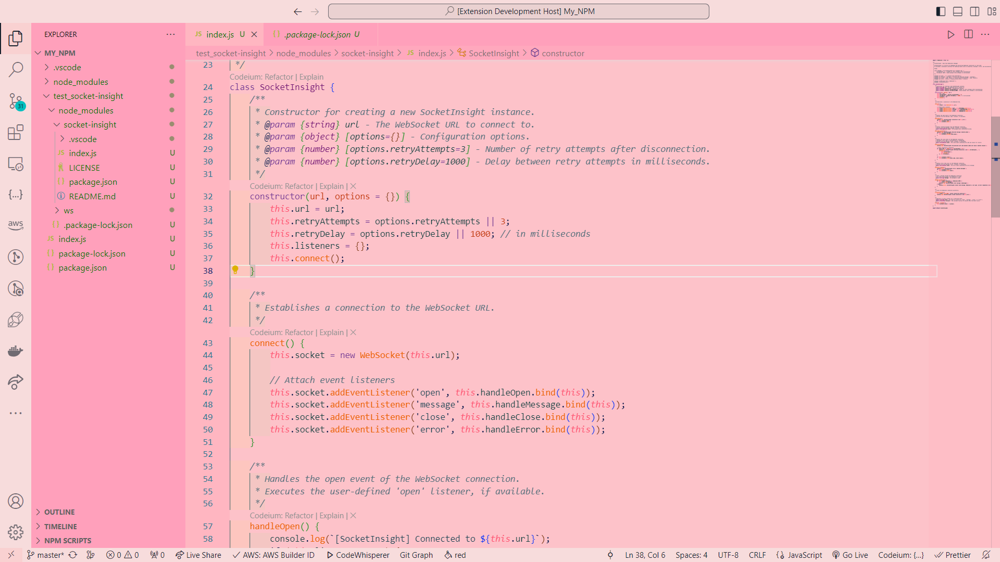

# pinkpom README

Welcome to pinkpom, a vibrant and modern color theme designed to enhance your coding experience in Visual Studio Code. This theme provides a visually delightful environment with a carefully curated palette by Aman Kirmara.

## Features

- **Color Palette:** A delightful color palette that balances vibrancy with comfort, offering a visually engaging coding experience.
- **Reduced Eye Strain:** Designed to be easy on the eyes, pinkpom reduces strain during extended coding sessions.
- **Modern Aesthetics:** Offers a combination of bright backgrounds and contrasting foregrounds for a refreshing and modern look.

## Installation

1. Open Visual Studio Code.
2. Go to the Extensions view (`Ctrl+Shift+X` or `Cmd+Shift+X`).
3. Search for "pinkpom" in the Extensions view search box.
4. Install the theme by Aman Kirmara.

## Usage

Activate the pinkpom theme by following these steps:

1. Click on the gear icon in the lower-left corner to open the Settings.
2. Choose "Color Theme" from the dropdown menu.
3. Select "pinkpom" from the list.

## Screenshots

## Contributing

If you encounter any issues or have suggestions for improvements, feel free to open an [issue](https://github.com/AmanKirmara/pinkpom.git) or submit a [pull request](https://github.com/AmanKirmara/pinkpom.git) on GitHub.

## License

This theme is licensed under the [MIT License](LICENSE).

## Acknowledgments

Special thanks to the [Visual Studio Code](https://code.visualstudio.com/) team for providing a fantastic platform for developers.

**Enjoy coding with pinkpom!**
